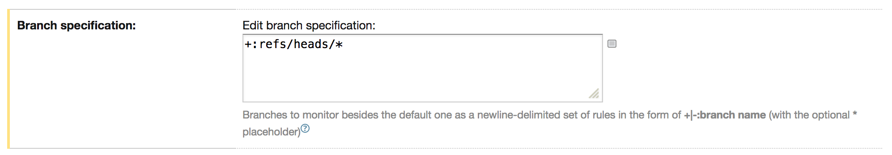
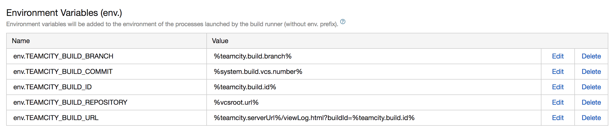

# Codecov global executable uploader for .NET Framework/Core based builds.

| [https://codecov.io/](https://codecov.io/) | [@codecov](https://twitter.com/codecov) | [hello@codecov.io](mailto:hello@codecov.io) |
| ------------------------ | ------------- | --------------------- |

## Introduction

[](https://ci.appveyor.com/project/AdmiringWorm/codecov-exe)
[](https://www.nuget.org/packages/Codecov/)
[](https://www.nuget.org/packages/Codecov.Tool/)
[](https://chocolatey.org/packages/codecov)
[](https://gitter.im/codecov-exe/community)
[](https://codecov.io/gh/codecov/codecov-exe)

1. This uploader supports Windows 7 (x64) and above, Linux (x64), and OS X (x64).

2. [See the following section of supported CI providers](#ci-providers).

3. Many Codecov CLI options are supported. Run `.\codecov.exe --help` or see [CommandLineOptions.cs](https://github.com/codecov/codecov-exe/blob/master/Source/Codecov/Program/CommandLineOptions.cs) for more details.

4. On windows you can download the exe from [NuGet](https://www.nuget.org/packages/Codecov) or [Chocolatey](https://chocolatey.org/packages/codecov). There is also the .Net tool called [Codecov.Tool](https://www.nuget.org/packages/Codecov.Tool) which supports all platforms. As an alternative to NuGet or Chocolatey you can download the exe as the asset *Codecov-{os}.zip* under the release. The following PowerShell (version 5) commands might be helpful.

```PowerShell
(New-Object System.Net.WebClient).DownloadFile("<url>", (Join-Path $pwd "Codecov.zip")) # Download Codecov.zip from github release.
Expand-Archive .\Codecov.zip -DestinationPath . # UnZip the file.
.\Codecov\codecov.exe # Run codecov.exe with whatever commands you need.
```

## Quick Start

For a basic use case, in PowerShell run the following commands,

```PowerShell
> choco install codecov
> codecov.exe -f <path to coverage report> -t <Codecov upload token>
```

or using the .NET Core tool

```shell
dotnet tool install --global Codecov.Tool
codecov -f <path to coverage report> -t <Codecov upload token>
```

For an AppVeyor build, the *appveyor.yml* file would look something like

```yml
before_build:
- choco install codecov # Can be changed to dotnet tool install --global Codecov.Tool
test_script:
# Note that, a Codecov upload token is not required.
- codecov -f <path to coverage report>
```

## Cake Addin

If you use [Cake](http://cakebuild.net/) (C# Make) for your builds, you may be intrested in the [Cake.Codecov](https://github.com/cake-contrib/Cake.Codecov) addin.

## CI Providers

The following CI providers are supported:

|     Company     |       Supported           |  Token Required  |
| --------------- | ------------------------- | ---------------- |
| AppVeyor        | Yes                       | Private only     |
| Azure Pipelines | Yes                       | Private          |
| Git             | Yes (as a fallback)       | Public & Private |
| GitHub Actions  | Partial (git as fallback) | Public & Private |
| Jenkins         | Yes                       | Public & Private |
| TeamCity        | Yes (See below)           | Public & Private |
| Travis CI       | Yes                       | Private only     |

### TeamCity

TeamCity does not automatically make build parameters available as environment variables. You will need to add the [following environment parameters](https://github.com/codecov/support/wiki/TeamCity) to the build configuration. To do this make sure your *Branch specification* under the VCS Root is configured correctly,

<p>
  
</p>

Then set your environment variables,

<p>
  
</p>

Note that, the above environment variables (except for `env.TEAMCITY_BUILD_URL`) can alternatively be set via the command line,

```shell
env.TEAMCITY_BUILD_BRANCH => --branch
env.TEAMCITY_BUILD_ID => --build
env.TEAMCITY_BUILD_COMMIT => --sha
env.TEAMCITY_BUILD_REPOSITORY => --slug
```

## Questions and Contributions

All types of contributions are welcome! Feel free to open an [issue](https://github.com/codecov/codecov-exe/issues) or contact us through the [gitter channel](https://gitter.im/codecov-exe/community) mentioning either **[@larzw](https://gitter.im/larzw)** or **[@AdmiringWorm](https://gitter.im/admiringworm)**.

### Known Issues

- Specifiyng file paths with spaces is currently not possible without a workaround.
  This is expected to be fixed when a new major release of codecov-exe is released (See issue [#71](https://github.com/codecov/codecov-exe/issues/71) for possible workaround and tracking).
  
- If you're seeing an **HTTP 400 error when uploading reports to S3**, make sure you've updated to at least version 1.11.0. 


## Maintainers

To create a relase, please do the following:

- Push the latest changes to the master branch on github
- Navigate to the release page and view the drafted release.
- Make any necessary changes.
- Publish the draft release on GitHub, targeting the master branch.
